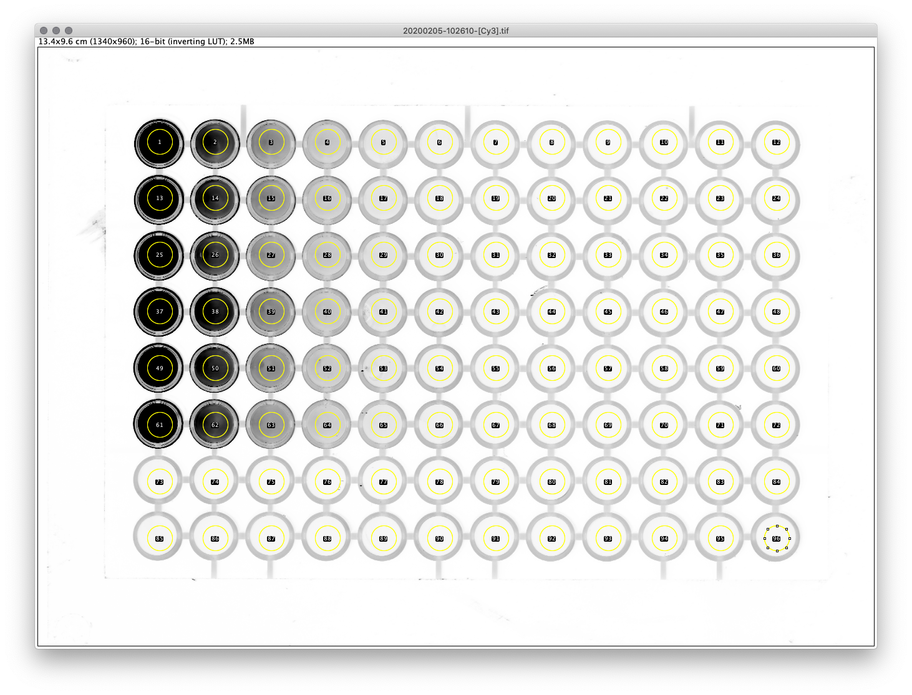

# Read a 96-well plate

Unable to find a solution, I've decided to write my own ImageJ plugin.

This is borrowing heavily from the XXXX plugin written by XXX. 

Makes a few tweaks so it can handle single-colour images with more bit-depth and easier to draw the grid. 

