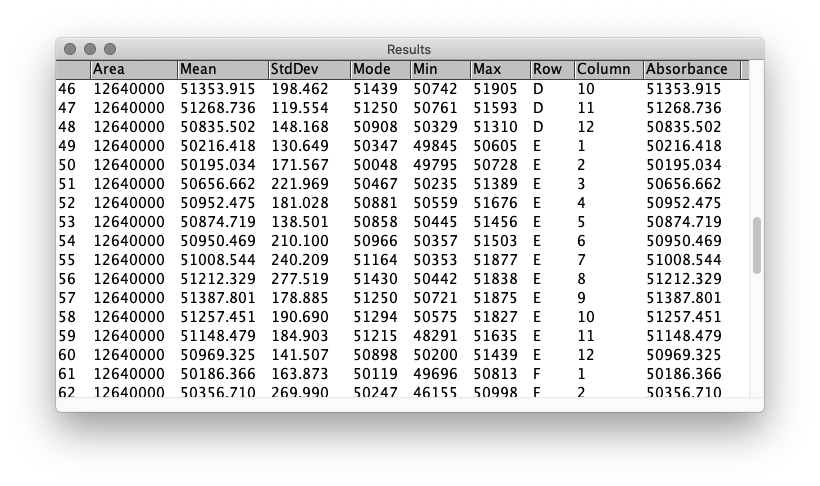

# Read a 96-well plate

Unable to find a solution, I've decided to write my own ImageJ plugin.

This is borrowing heavily from the "Readplate5" plugin written by Jose Maria Delfino (2016).

Makes a few tweaks so it can handle single-colour images with more bit-depth and easier to draw the grid.

Steps as follows:
1. Draw straight line between A1 and A12
2. Press "OK"
3. Draw straight line between H1 and H12
4. Press "OK"
5. Save results.csv to folder location of choice.

## Prompt Box

## Example Grid

## Example results

